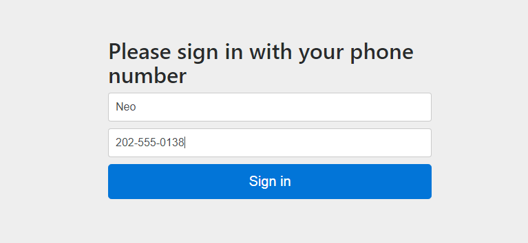
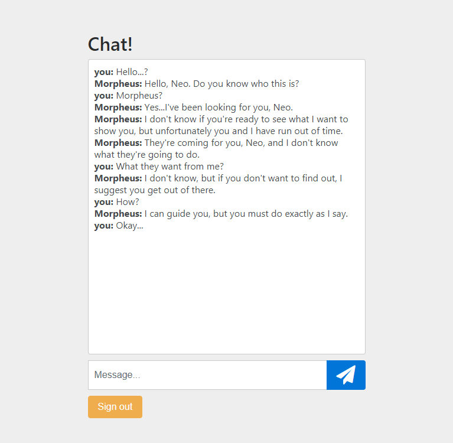
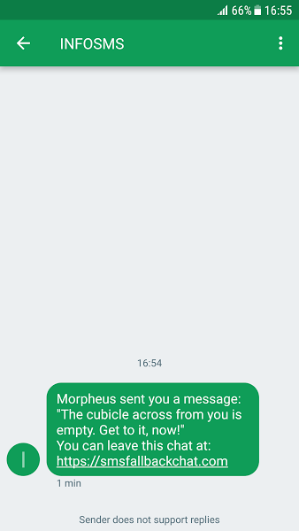

# Infobip PubNub demo

## Introduction

This is a demo project detailing the setup and capabilities of integration between PubNub and Infobip platforms on a real life use case of a chat application.

With PubNub's easy to use and highly performant serverless application environment and broad reach and reliability of Infobip's SMS delivery solution we will develop a robust chat application in no time.

## Use case

In the course of this post we will develop a highly reliable chat web application. PubNub's real time communication capabilities are a great fit for chat  apps. However, they usually rely on internet availability for message delivery. In this scenario our users' chat messages are time critical and their delivery must be guarantied under all circumstances.

SMS text messages are a perfect fit for fulfilling those requirements. Infobip brings reliability of SMS to the world of PubNub development with newly published Infobip SMS function.

Our final product will rely on the PubNub network to deliver messages to online users and fall back to SMS texts for those that loose their web connection.

## Prerequisites

In order to follow along with this tutorial you will need to have both Infobip and PubNub accounts. You can open a free PubNub account [here](https://admin.pubnub.com/#/register). Similarly, fill out this [registration form](https://www.infobip.com/en/get-started) to request an Infobip account. In addition to the account you will also need to generate an Infobip API key. Details on how to do that can be found on [documentation page](https://dev.infobip.com/docs/api-key#create-new-api-key).

## Implementation

Our app will compose of two parts: static web app that will run the basic chat interface and a pair of PubNub functions running in the back-end that will determine when to fall back to SMS and pipe the appropriate messages to Infobip SMS function.

All of this will be grouped under single PubNub application, and using one keyset. After creating a new app default keyset will be set up. One thing that is required is to enable the presence feature for the keyset. You can find out more about presence from [official docs](https://www.pubnub.com/products/presence/). 

In addition to updating the keyset we'll need to install the Infobip SMS function. You can find it in [blocks catalog](https://www.pubnub.com/docs/blocks-catalog/infobip-sms). Just make sure to install it under appropriate app / keyset combination and set up the Infobip API key within its code. For details on SMS function setup check out the accompanying [walkthrough](https://www.pubnub.com/docs/blocks-catalog/infobip-sms#walkthrough).

### Chat app client

For it's part the static chat web app is a classic PubNub subscribe / publish application. 

Down the road we'll need the ability to send SMS text messages to users that drop out of the chat without signing out. To do that we'll need their phone numbers, so we require users accessing the app to fill out a simple sign-in form with their screen name and phone number. 



Both input values are later on grouped together and used as an `uuid` when setting up the PubNub client.

```javascript
// constants setup
var SUB_KEY = 'YOUR_SUB_KEY'; // this should be populated by actual keyset data
var PUB_KEY = 'YOUR_PUB_KEY'; // and so should this
var CHAT_CHANNEL = 'chat-channel';

// input reading
var name = $('inputName').value;
var phone = $('inputPhone').value;
var uuid = name + '@' + phone;

// PubNub initialization
var pubnub = new PubNub({
    subscribeKey: SUB_KEY,
    publishKey: PUB_KEY,
    uuid: uuid
});

// Channel subscription
pubnub.subscribe({
  channels: [ CHAT_CHANNEL ]
});
```

Chat interface itself is rather simple. It handles 3 basic events:
* arrival of new messages on the subscribed channel, and their rendering on screen
* submission of new messages by the user, and their publishing to PubNub
* user signing out, that triggers unsubscribe event on PubNub client and refreshes the app

When sending new messages we include the uuid of currently signed in user. That will be used on the receiving side to display the screen name of the message sender. In addition we also include the url of the chat app itself. That url will not be visible within the web app but will instead be included in the fallback SMS text. 

```javascript
function publishMessage() {
  var input = $('inputMessage');
  pubnub.publish(
    {
      channel : CHAT_CHANNEL,
      message : {
        text: input.value,
        sender: uuid,
        chatRoom: window.location.href
      }
    }, 
    function () { 
      input.value=''; 
    }
  );
}
```

When handling the incoming messages we can extract the screen name from the sender and display it before the message text itself:

```javascript
function handleIncomingMessage(obj) {
  var text = sanitize(obj.message.text);
  var sender = extractScreenNameFrom(obj.message.sender);
  var messagesBox = $('chatMessages');
  messagesBox.innerHTML += '<b>' + sender + ':</b>\t' + text + '<br>';
  messagesBox.scrollTop = messagesBox.scrollHeight;
}
```

Last action of importance is to unsubscribe the user from the `chat-channel` when they click sing out button.

```javascript
function singOut() {
  pubnub.unsubscribeAll();
  location.reload();
}
```

With that we now have all the functionality needed for a standard chat app.



### SMS fallback

Unfortunately, our current implementation is entirely reliant on user's internet connection. Loosing it would prevent them from receiving time critical messages. We'll implement the SMS fallback by tracking users online status via the PubNub's presence feature.

To use the presence functionality it must first be enabled in the keyset configuration. Once that's done we need to make a small update to our static web app. PubNub client's configuration needs to be updated with presence specific properties:

```javascript
// initialization
var pubnub = new PubNub({
  subscribeKey: SUB_KEY,
  publishKey: PUB_KEY,
  uuid: uuid,
  presenceTimeout: 10,
  heartbeatInterval: 5
});
// subscription
pubnub.subscribe({
  channels: [ CHAT_CHANNEL ],
  withPresence: true
});
``` 
Now that the client part of the application is done we'll complete the project by implementing a pair of [PubNub functions](https://www.pubnub.com/products/functions/).

With the client code updated we can receive the events not just every time a user joins and leaves our chat channel, but also when their connection times out. We'll want to keep track of users whose connection timed out, updating our list if they reconnect, or leave the channel.

For simplicity we will use the integrated key/value store, but you may build more robust concurrent solution for production ready products.

```javascript
// PubNub function settings:
// Event type: After Presence
// Channel: chat-channel
export default (request) => {
  const db = require('kvstore');
  const DESTINATION_KEY = 'smsDestinations';
  const uuid = request.message.uuid;
  db.get(DESTINATION_KEY).then((found) => {
    const destinations = found ? found : [];
    switch(request.message.action) {
      case 'join':
      case 'leave':
        removeElementFromArray(uuid, destinations);
        break;
      case 'timeout':
        destinations.push(uuid);
        break;
    }
    db.set(DESTINATION_KEY, destinations);
  });
  return request.ok();
};
```

Now we have a persisted list of users that have lost the connection to PubNub. All that is left to do is send them SMS text messages when someone posts in the chat. For that we'll create a function that handles After Publish events on `chat-channel` and publishes new, SMS appropriate, messages on the `infobip_sms` channel. Messages published on that channel will be automatically picked up by the already installed Infobip SMS function and forwarded to Infobip API. 

```javascript
// PubNub function metadata:
// Event type: After Publish or Fire
// Channel: chat-channel
export default (request) => {
  const db = require('kvstore');
  const pubNub = require('pubnub');
  const DESTINATION_KEY = 'smsDestinations';

  const message = request.message;
  const chatRoom = message.chatRoom;
  const sender = message.sender.substring(0, message.sender.lastIndexOf('@'));

  db.get(DESTINATION_KEY).then((destinations) => {
    destinations.forEach((uuid) => {
      const phoneNumber = uuid.substring(uuid.lastIndexOf('@') + 1);
      const queryParam = `uuid=${uuid.replace(/ /g, '+')}`;
      const smsText = `${sender} sent you a message: "${message.text}". You can leave this chat at: ${chatRoom}`;
      // SMS message model is defined by the Infobip SMS function
      const smsMessage = {
          to: phoneNumber, // text message destination is a required field
          text: smsText // text of the message itself
      };
      // messages are published on the channel that Infobip SMS function is listening on
      pubNub.publish({ 
        channel: 'infobip_sms',
        message: smsMessage
      });
    });
  });
  return request.ok();
};
```

And with that we can guarantee our users delivery of time sensitive messages even if their internet connection drops.



## Source code

You can find the finished source code for the entire project on Github. If you wish you can fork it and host the static web app part of it yourself. Additionally, you can use included code for the custom PubNub functions to jump start your own SMS fallback solution.